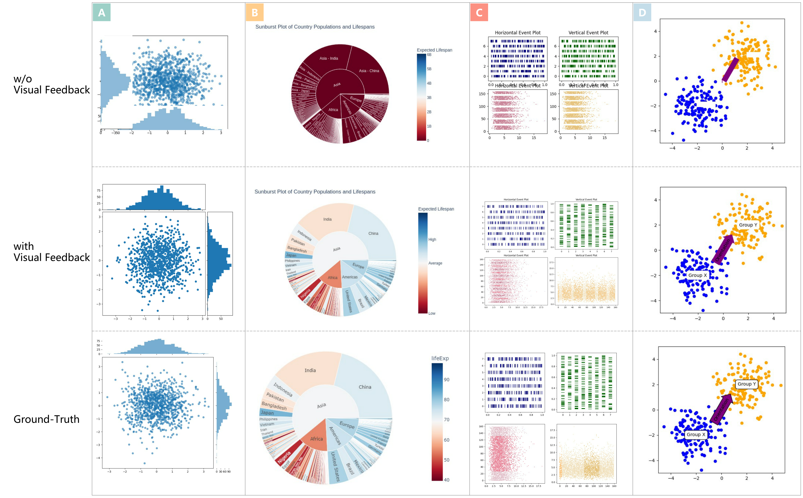

<div align="center">


**MatPlotAgent: Enhancing Scientific Data Visualization with LLMs**

<p align="center">•
 <a href="#Introduction"> Introduction </a> •
 <a href="#Contributions">Contributions</a> •
 <a href="#Getting Started">Getting Started</a> •
 <a href="#Experiment Results">Experiment Results</a> •
 <a href="https://arxiv.org/abs/2402.11453">Paper</a>
</p>
</div>

## Introduction
Scientific data visualization is crucial for conveying complex information in research, aiding in the identification of implicit patterns. Despite the potential, the use of Large Language Models (LLMs) for this purpose remains underexplored. "MatPlotAgent" introduces an innovative, model-agnostic LLM agent framework designed to automate scientific data visualization tasks, harnessing the power of both code LLMs and multi-modal LLMs.

The integration of LLMs into scientific data visualization represents a new frontier in research technology. Current tools, while advanced, still pose challenges in transforming raw data into insightful visualizations due to time-consuming and labor-intensive processes. MatPlotAgent is conceived to bridge this gap, leveraging LLM capabilities to enhance human efficiency significantly.

## Contributions

- **MatPlotAgent Framework**: Comprises three core modules for a comprehensive approach to data visualization:
  1. **Query Expansion**: Thoroughly interprets user requirements and transform them into LLM-friendly instructions
  2. **Code Generation with Iterative Debugging**: Uses code to preprocess data and generate figures, with self-debugging capabilities.
  3. **Visual Feedback Mechanism**: Employs visual perceptual abilities for error identification and correction.

- **MatPlotBench**: A high-quality benchmark of 100 human-verified test cases alongside a scoring approach utilizing GPT-4V for automatic evaluation, demonstrating strong correlation with human-annotated scores.

- **Generalizability**: Demonstrated effectiveness with various LLMs, including commercial and open-source models.

## Getting Started

This project opensources the following components to foster further research and development in the field of scientific data visualization:

- **Benchmark Data (MatPlotBench)**: A meticulously crafted benchmark to quantitatively evaluate data visualization approaches.
- **Evaluation Pipeline**: Utilizes GPT-4V for automatic evaluation, offering a reliable metric that correlates strongly with human judgment.
- **MatPlotAgent Framework**: The entire codebase for the MatPlotAgent framework is available, encouraging adaptation and improvement by the community.

#TODO
[Instructions on how to access and use the benchmark data, evaluation pipeline, and the MatPlotAgent framework.]

## Experiment Results

Our experiments showcase MatPlotAgent's ability to improve LLM performance across a variety of tasks, with notable enhancements in plot quality and correctness, supported by both quantitative scores and qualitative assessments.

| Model                                         | Direct Decod. | Zero-Shot CoT | MatPlotAgent      |
|-----------------------------------------------|---------------|---------------|-------------------|
| **GPT-4**                                     | 48.86         | 45.42 (-3.44) | 61.16 (**+12.30**)|
| **GPT-3.5**                                   | 38.03         | 37.14 (-0.89) | 47.51 (**+9.48**) |
| **Magicoder-S-DS-6.7B** ([Wei et al.,](https://arxiv.org/abs/2312.02120))    | 38.49         | 37.95 (-0.54) | 51.70 (**+13.21**)|
| **Deepseek-coder-6.7B-instruct** ([Guo et al.,](https://arxiv.org/abs/2401.14196)) | 31.53  | 29.16 (-2.37) | 39.45 (**+7.92**)  |
| **CodeLlama-34B-Instruct** ([Rozière et al.,](https://arxiv.org/abs/2308.12950))  | 16.54         | 12.40 (-4.14) | 14.18 (-2.36)     |
| **Deepseek-coder-33B-instruct** ([Guo et al.,](https://arxiv.org/abs/2401.14196))  | 30.88  | 36.10 (**+5.22**) | 32.18 (**+1.30**)|
| **WizardCoder-Python-33B-V1.1** ([Luo et al.,](https://arxiv.org/abs/2306.08568))   | 36.94  | 35.81 (-1.13) | 45.96 (**+9.02**) |

_Performance of different LLMs on MatPlotBench. For each model, improvements over the direct decoding are highlighted in **bold**._



*Figure: Examples to illustrate the effect of visual feedback. To investigate the effect of the visual feedback mechanism on different models, we display the outputs of two representative LLMs. Case A, B, and C are generated by GPT-4. Case D is generated by Magicoder-S-DS-6.7B.*


*Figure: Case study of different models*


## Citation

Feel free to cite the paper if you think MatPlotAgent is useful.

```bibtex
@misc{yang2024matplotagent,
      title={MatPlotAgent: Method and Evaluation for LLM-Based Agentic Scientific Data Visualization}, 
      author={Zhiyu Yang and Zihan Zhou and Shuo Wang and Xin Cong and Xu Han and Yukun Yan and Zhenghao Liu and Zhixing Tan and Pengyuan Liu and Dong Yu and Zhiyuan Liu and Xiaodong Shi and Maosong Sun},
      year={2024},
      eprint={2402.11453},
      archivePrefix={arXiv},
      primaryClass={cs.CL}
}
```

## How to Contribute

We welcome contributions from the community! Whether it's by providing feedback, submitting issues, or proposing pull requests, your input is valuable in advancing this project.

#TODO
[Include link to the GitHub repository and contact information for the project maintainers.]

